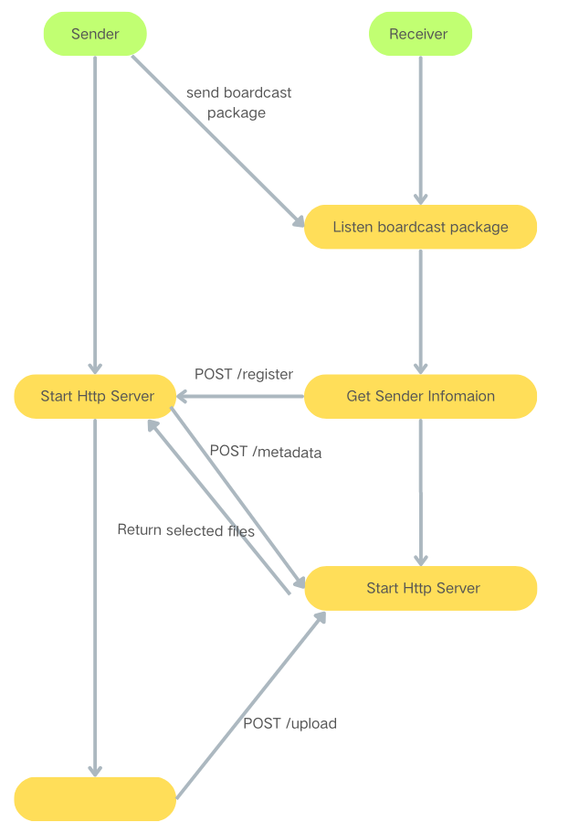
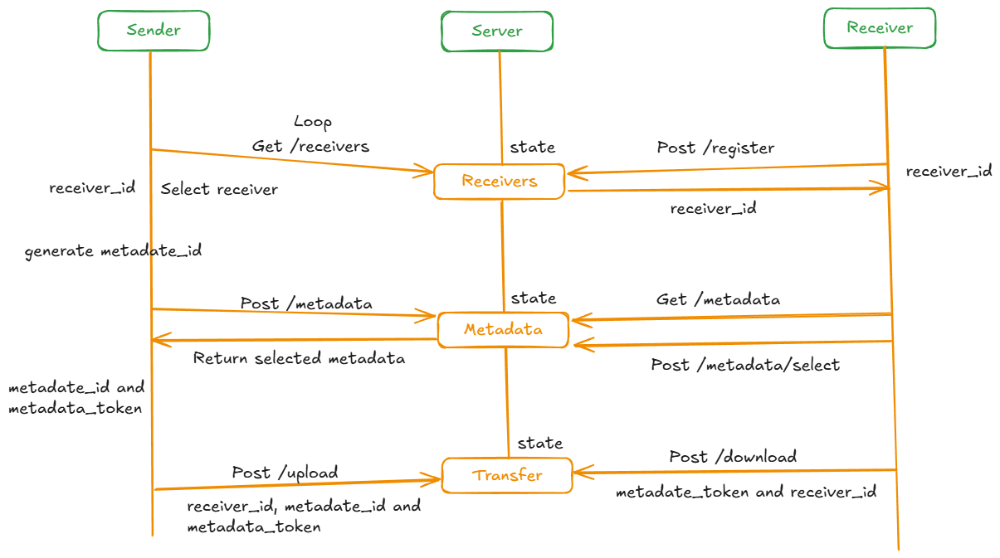

<div align="center">
  
</div>

## Kimika - CLI tool for sending text or files

Kimika is a CLI tool for sending text or files written in Rust, based on grpc. It aims to get rid of dependence on wechat or QQ.

- 🌟 Automatically search receivers
- 💫 Support pipeline
- 🖼️ Support transfer through remote server
- 💡 Support transfer through local network
- 💪 Based on grpc


## Installation

### Build from source

Follow [tonic getting started](https://github.com/hyperium/tonic?tab=readme-ov-file#dependencies) to install `protobuf complier`

```sh
cargo install --git https://github.com/yixiaojiu/kimika kimika
```

### Macos

```sh
brew install yixiaojiu/tap/kimika
```

## Document

- [docs/usage](/docs/usage.md)
- [docs/server](/docs/server.md)
- [docs/configuration](/docs/configuration.md)

## Procedure

Local Area Network



Remote Server



## Roadmap

- [ ] Change grpc to http
